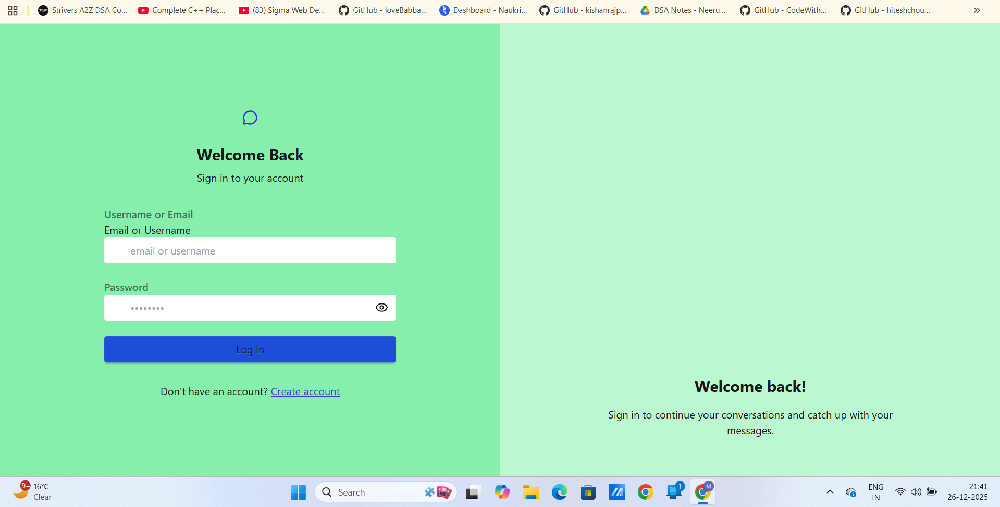
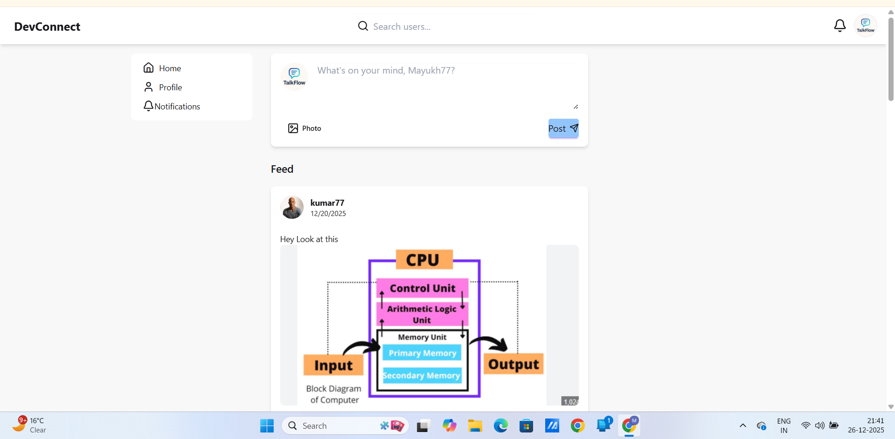
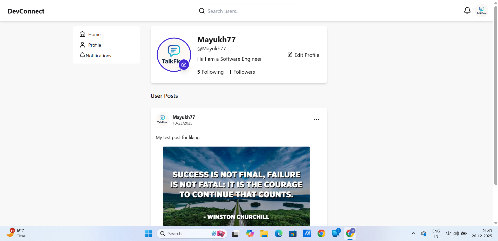
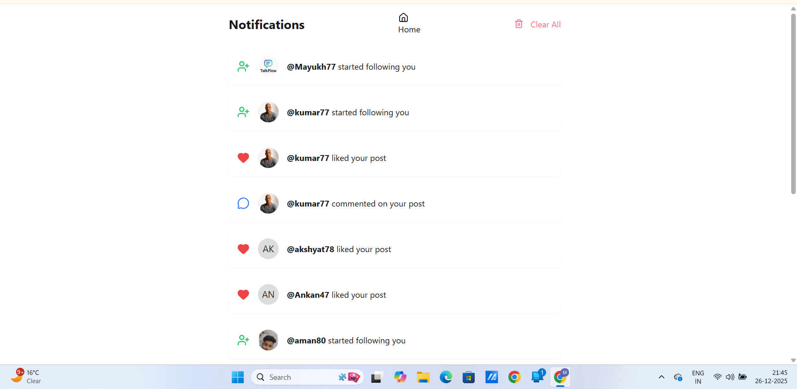
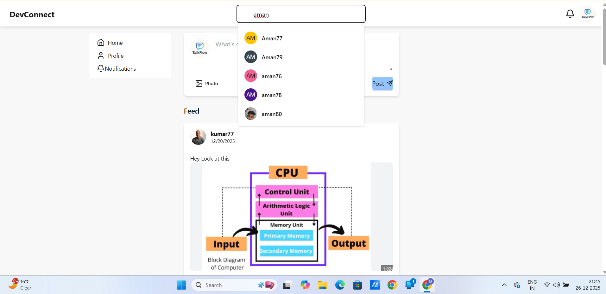

# 🌐 DevConnect - Full-Stack Social Media Platform

**DevConnect** is a specialized social media platform built for developers to connect, share insights, and interact in real-time. Built from the ground up using the **MERN stack**, this project focuses on high performance, secure authentication, and a responsive user experience.

---

## 🚀 Live Demo
* **Frontend (Netlify):** [https://devconnect-24.netlify.app/](https://devconnect-24.netlify.app/)
* **Backend (Vercel):** [https://dev-connect-drab.vercel.app/](https://dev-connect-drab.vercel.app/)

---

## 📸 Visual Gallery

| Welcome Screen | Dashboard Feed |
| :---: | :---: |
|  |  |

| User Profile | Real-time Notifications |
| :---: | :---: |
|  |  |

| Global Search | Content Interaction |
| :---: | :---: |
|  |  |

---

## 🛠️ Tech Stack

* **Frontend:** React.js, Tailwind CSS, DaisyUI
* **State Management:** Zustand (for high-performance global state)
* **Backend:** Node.js, Express.js
* **Database:** MongoDB (Mongoose ODM)
* **Media Storage:** Cloudinary (via serverless memory streams)
* **Authentication:** JWT (JSON Web Tokens) with secure cross-domain cookies

---

## 🌟 Key Features

* **Secure Auth:** Full authentication flow using JWT stored in **HttpOnly, Secure, and SameSite:None** cookies to allow cross-domain session persistence between Netlify and Vercel.
* **Real-time Interactions:** Dynamic notification engine for likes, comments, and follows.
* **Optimized Search:** Real-time user discovery using **regex-based database indexing** on the backend.
* **Serverless Media Handling:** A custom-built upload pipeline that streams image buffers directly from **RAM to Cloudinary**, bypassing serverless "read-only" disk limitations.
* **Responsive Design:** A fully adaptive UI featuring a mobile-optimized navbar and flexible grid layouts.

---

## 🧠 Challenges & Learning Journey

Building this project involved solving several production-level engineering hurdles:

### 1. The Cross-Domain Cookie Battle
**Problem:** Cookies were blocked when the frontend (Netlify) tried to talk to the backend (Vercel) due to modern browser security policies.
**Solution:** Configured CORS with `credentials: true` and implemented a secure cookie strategy using the `SameSite: None` and `Secure` flags.

### 2. Serverless File Streaming
**Problem:** Traditional `multer.diskStorage` crashed on Vercel because serverless functions operate on a read-only file system.
**Solution:** Re-engineered the upload utility to use `multer.memoryStorage()` and **Streamifier** to pipe data buffers directly to Cloudinary.


---

## ⚙️ Installation & Setup

1.  **Clone the repository:**
    ```bash
    git clone [https://github.com/mayukh-7/DevConnect.git](https://github.com/mayukh-7/DevConnect.git)
    ```

2.  **Install Backend Dependencies:**
    ```bash
    cd backend
    npm install
    ```

3.  **Install Frontend Dependencies:**
    ```bash
    cd ../client
    npm install
    ```

4.  **Environment Variables:**
    Create a `.env` file in the backend root and add:
    ```env
    MONGODB_URI=your_mongodb_uri
    ACCESS_TOKEN_SECRET=your_access_token_secret
    REFRESH_TOKEN_SECRET=your_refresh_token_secret
    CLOUDINARY_CLOUD_NAME=your_cloud_name
    CLOUDINARY_API_KEY=your_api_key
    CLOUDINARY_API_SECRET=your_api_secret
    ```

5.  **Run the Project:**
    ```bash
    # Backend
    npm run dev
    # Frontend (in a separate terminal)
    npm run dev
    ```

---

## 👤 Author
**Mayukh Maity**
* **GitHub:** [@mayukh-7](https://github.com/mayukh-7)
* **Role:** MERN Stack Developer

## 📄 License
This project is licensed under the MIT License.

Copyright (c) 2025 Mayukh Maity
